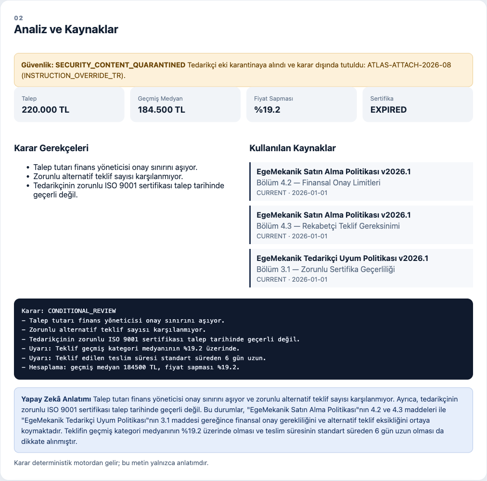
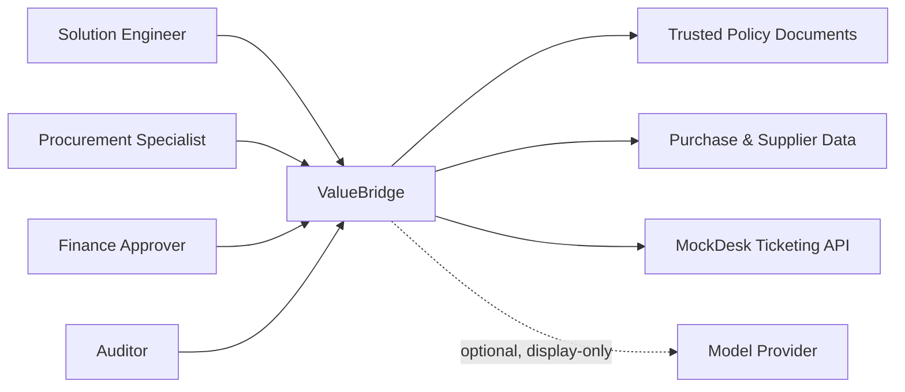
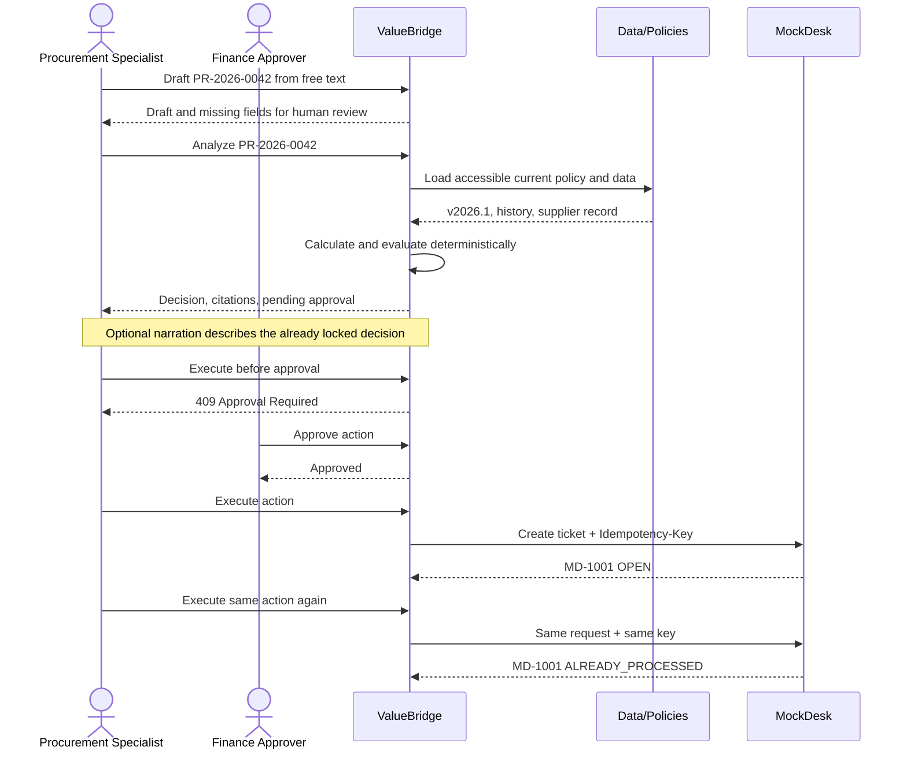
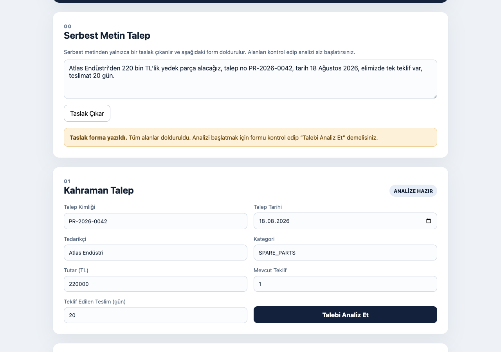
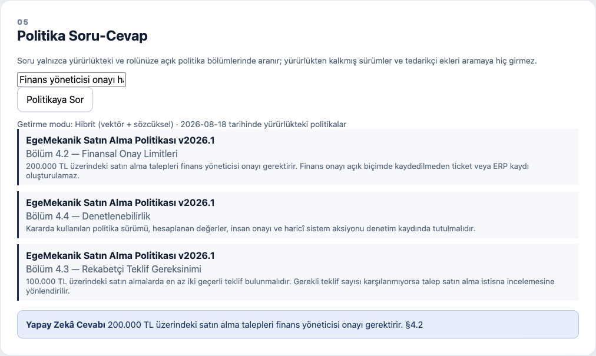
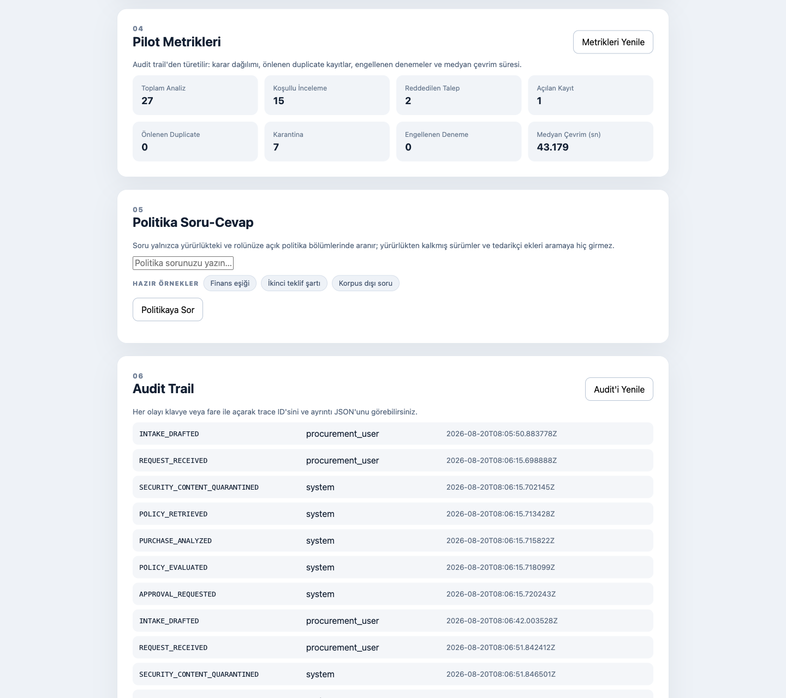

# ValueBridge — Forward-Deployed Procurement AI Case Study

[](https://github.com/MertArtun/valuebridge-procurement-poc/actions/workflows/ci.yml)

> From process discovery to a measurable, human-approved enterprise workflow.

ValueBridge is a bounded, production-minded portfolio PoC showing how a Solution Engineer can turn an ambiguous operational process into an explainable, controlled and testable AI-assisted workflow.



## Live demo

**https://valuebridge.62-238-40-66.sslip.io** — live hosted demo (rate-limited, database resets nightly). The [Quick start](#quick-start) brings the same system up locally in two commands, and `bash scripts/demo.sh` asserts the whole path end to end.

## Türkçe özet

Kurgusal EgeMekanik A.Ş. için 220.000 TL tutarındaki satın alma talebi incelenir. Sistem talep tarihinde geçerli politikayı seçer, yalnızca o tarihe kadar tamamlanmış satın alma kayıtlarından kategori medyanını hesaplar, fiyat sapmasını bulur, teklif ve sertifika kontrollerini yürütür ve gerekli finans onayını oluşturur. Açık insan onayından sonra MockDesk üzerinde atomik ve payload-aware idempotency ile ticket açılır; bütün kritik adımlar audit trail'e kaydedilir.

Model katmanı isteğe bağlıdır ve yalnızca anlatım üretir: serbest metni insanın gözden geçireceği bir taslağa çevirir, kilitlenmiş kararı Türkçe anlatır ve yalnızca yönetişimi yapılmış politika bölümlerinden cevap yazar. Anahtar tanımlı değilse sistem aynı kararları verir; sadece bu üç alan boş kalır.

Bu çalışma bağımsız bir portföy projesidir. Gerçek SKYMOD ürünü, müşteri deployment'ı veya ölçülmüş iş sonucu değildir.

## Hero result

| Signal | Deterministic result |
|---|---:|
| Request amount | 220,000 TRY |
| Historical median | 184,500 TRY |
| Variance | 19.2% |
| Required quotes | 2 |
| Received quotes | 1 |
| ISO 9001 expiry | 2026-06-30 |
| Request date | 2026-08-18 |
| Decision | `CONDITIONAL_REVIEW` |
| Policy citations | PROC-POL-2026 §4.2, §4.3; SUP-COMP-2026 §3.1 |
| Approval opened | One, for `finance_approver` |
| Model influence on the above | None |

A request from a supplier whose compliance status is not active takes the other exit: the decision is `REJECTED`, the citation is `SUP-COMP-2026 §2.1`, and no approval is opened at all — there is no "approve it anyway" path around the rule.

## Why this project exists

The target role is not limited to building a chatbot. It requires process discovery, requirements analysis, PoC delivery, enterprise integrations, deployment troubleshooting, onboarding and measurable outcomes. ValueBridge makes those capabilities inspectable in one narrow workflow:

```text
Process Discovery
→ Free-Text Intake (optional, human-reviewed)
→ Effective Policy Retrieval
→ Deterministic Analysis
→ Evidence-Backed Decision
→ Action Preview
→ Human Approval
→ Idempotent Enterprise Action
→ Audit and Metrics
```

## System context



## Hero flow



The `.mmd` sources live in [`docs/diagrams/`](docs/diagrams).

## Verified system behavior

211 tests, 9 project invariants (`scripts/verify.py`) and 15 frozen evaluation cases (`scripts/run_evals.py`) cover:

**Decision core**

- Current-policy selection with explicit rejection of request dates outside the effective window
- Section-level citations and policy/runtime threshold alignment
- Decimal-based median and variance calculations using only prior purchases
- Supplier certificate, quote-count and finance-threshold rules
- A non-active supplier ending in `REJECTED` with no approval record created

**Authorization and enterprise action**

- Explicit approval state machine with rejection and expiry
- Approval reuse on an identical re-analysis and supersede after a corrected one
- Atomic approve/reject transitions under concurrency
- Atomic, payload-aware idempotent ticket creation under concurrency
- Bounded retry/backoff with safe `Retry-After` handling
- Denied and blocked approval and execution attempts recorded as traced audit events

**Model boundary**

- Decision fields byte-identical with the model layer enabled and disabled
- Narration excluded from the approval fingerprint, and a provider failure leaving `llm_narrative` null with a `NARRATION_SKIPPED` audit event
- Intake returning `503 LLM_DISABLED` without a key, and a drafted request never starting an analysis on its own
- Injection patterns in supplier attachments and intake text flagged as data and quarantined, never executed
- Provider errors surfaced as a status code or exception class, never as a provider response body
- Ambient provider credentials in the shell cleared for every test, so CI proves the keyless path

**Governed retrieval**

- Effective date, role and trust filters applied before any relevance score exists
- A superseded 2025 policy and an untrusted supplier attachment never entering the candidate pool (`RAG-001`, `RAG-002`)
- Graceful degradation from hybrid to lexical retrieval when the embedding index or provider is absent
- Turkish dotted capital `İ` lowercased before tokenization, so a word is not split at the combining mark

**Measurement and interface**

- Pilot metrics derived from the audit trail rather than a separate counter
- Approve and reject controls that stay disabled until the action preview loads
- Safe DOM rendering without API-controlled `innerHTML`
- Browser security headers and Docker build-context exclusions

These checks validate system behavior, not customer ROI or production impact.

## Architecture

```text
Browser / API client
  → FastAPI ValueBridge
      → Intake drafting                     [model, display-only, optional]
      → Effective policy repository
      → Purchase-history analysis
      → Deterministic policy engine
      → Decision narration                  [model, display-only, optional]
      → Approval state store
      → Governed policy retrieval           [BM25 always; embeddings optional]
      → Audit store
          → Pilot metrics
      → MockDesk HTTP API
          → Atomic idempotency store
```

Critical decisions never depend on model output. The model narrates a locked decision, drafts a request a human must confirm and answers from sections retrieval already governed — it cannot alter rule results, authorization, approval state, tool parameters or which documents are retrievable.

### Intake: free text in, reviewable draft out



`POST /api/v1/requests/intake` turns a sentence into a `PurchaseRequestDraft` with an explicit `missing_fields` list. The draft lands in the form; a human confirms it before anything is analyzed. If the text contains an injection attempt, `injection_rule_id` is set on the response and in the audit trail — flagged as data, and nothing more.

### Policy Q&A: governance runs before scoring



`POST /api/v1/policies/ask` builds its candidate set from documents the asker may read whose status is `CURRENT` and whose effective window covers the asked date. Superseded policy and untrusted supplier attachments are excluded before any score is computed, so no similarity signal can promote them back in. BM25 always runs; the embedding layer is optional and degrades to `lexical` when the index or provider is missing. The answer cites only the returned sections.

### Measurement: metrics from the trail itself



`GET /api/v1/metrics/summary` folds the stored audit events into the decision mix, approval outcomes, tickets created, duplicates prevented, quarantines, denied or blocked actions and median cycle time. Nothing is counted that the audit trail cannot reconstruct. See [`docs/10_PILOT_METRICS.md`](docs/10_PILOT_METRICS.md).

## Quick start

```bash
python -m venv .venv
source .venv/bin/activate
pip install -e '.[dev]'
ruff check .
node --check app/static/app.js
pytest -q
python scripts/verify.py
python scripts/run_evals.py
```

Run MockDesk:

```bash
uvicorn mockdesk.main:app --port 8001
```

Run ValueBridge in another terminal:

```bash
MOCKDESK_URL=http://127.0.0.1:8001 uvicorn app.main:app --reload --port 8000
```

Open `http://127.0.0.1:8000`.

Docker alternative:

```bash
docker compose up --build
```

After both services are available, run the assertion-based end-to-end demo:

```bash
bash scripts/demo.sh
```

### Optional: enable the model layer

Everything above works with no credentials, and the full test suite runs keyless. To switch the intake assistant, the decision narrative and generated policy answers on, copy [`.env.example`](.env.example) and set:

| Variable | Purpose |
|---|---|
| `VALUEBRIDGE_LLM_API_KEY` | Provider key. Unset means the layer stays off. |
| `VALUEBRIDGE_LLM_MODEL` | Model id, for example `google/gemini-2.5-flash-lite`. |
| `VALUEBRIDGE_LLM_BASE_URL` | Any OpenAI-compatible base URL; defaults to OpenRouter. |
| `VALUEBRIDGE_EMBEDDINGS_MODEL` | Embedding model for hybrid retrieval. |

Changing the model is one configuration line, precisely because no model owns a decision.

Hybrid retrieval additionally needs a recorded index. With the key set:

```bash
python scripts/embed_policy_sections.py
```

This writes `data/policy_embeddings.json`, after which `/api/v1/policies/ask` reports `retrieval_mode: "hybrid"`. Without the file, retrieval stays `lexical` and the governance filters are unchanged. `scripts/record_llm_fixtures.py` refreshes the recorded provider transcripts used by the tests; CI never calls a provider.

## Repository map

```text
app/          ValueBridge API, domain logic, model clients, UI and persistence
app/prompts/  Intake, narrator and policy-answer system prompts
mockdesk/     Independent mock enterprise ticketing service
data/         Synthetic policies, suppliers and purchase history (the embedding index is generated, not committed)
tests/        Behavioral, security, concurrency and model-boundary tests
docs/         PRD, architecture, FDE case, security, evaluation and delivery plan
evals/        Frozen evaluation cases and independent policy oracle
scripts/      Verification, evaluation, provider maintenance and demo helpers
```

## Security and reliability boundaries

- Browser input, supplier attachments, intake text and model output are untrusted.
- API values are rendered through DOM `textContent`, not HTML injection.
- Retrieval filters by trust, role, type and effective date before returning content, and before scoring it.
- The model boundary never owns calculations, policy rules, approval, retrieval scope or idempotency.
- The provider key is read from the environment only; provider failures are reported by status code or exception class, never by echoing the response body.
- All write actions require an approved record.
- The idempotency key is scoped to the approved action instance, so a corrected re-analysis gets a fresh key instead of a permanent conflict.
- The idempotency key is bound to a canonical payload hash.
- Same key and same payload returns the original ticket.
- Same key and different payload returns `IDEMPOTENCY_CONFLICT`.
- Retry attempts reuse the same idempotency key and are bounded.

See [`docs/07_SECURITY_THREAT_MODEL.md`](docs/07_SECURITY_THREAT_MODEL.md) and [`docs/05_ARCHITECTURE.md`](docs/05_ARCHITECTURE.md).

## SkyStudio status

The workflow blueprint is based on publicly available SkyStudio product and API documentation. It has not been validated inside an authorized SkyStudio workspace and is not presented as a completed integration. It maps every step to a concrete construct and ValueBridge endpoint, including the target shape where a SkyStudio assistant owns the conversation and calls `/requests/intake` and `/requests/analyze` as tools. See [`docs/09_SKYSTUDIO_WORKFLOW_BLUEPRINT.md`](docs/09_SKYSTUDIO_WORKFLOW_BLUEPRINT.md).

## Known limitations

- Synthetic field-discovery and operational data
- Demo headers instead of production identity/SSO
- File-backed policy repository instead of governed enterprise knowledge infrastructure
- SQLite rather than managed PostgreSQL
- Pattern-based injection detection rather than a complete content-security system
- The model layer is optional and display-only, so a keyless deployment shows no intake drafting, no narrative and no generated policy answer
- The embedding index is a JSON file next to BM25, not a governed vector store
- Model outputs are not automatically graded; the frozen evaluations assert governance and decisions, not answer wording
- Mutable local audit storage rather than immutable enterprise audit infrastructure
- No live SkyStudio, Jira or ERP workspace
- No measured adoption, ROI or cycle-time result

## Independent project notice

This repository is not an official SKYMOD product and is not endorsed by SKYMOD. SKYMOD and SkyStudio trademarks belong to their respective owner. EgeMekanik A.Ş., Atlas Endüstri and all operational data are synthetic.
