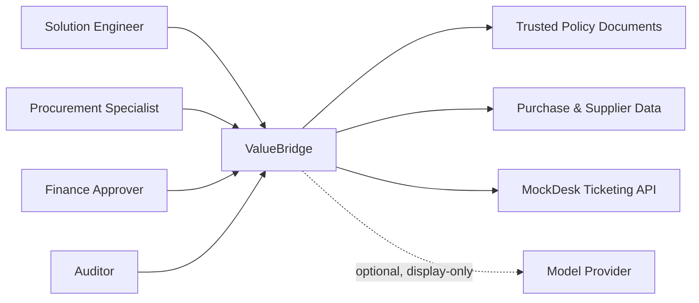
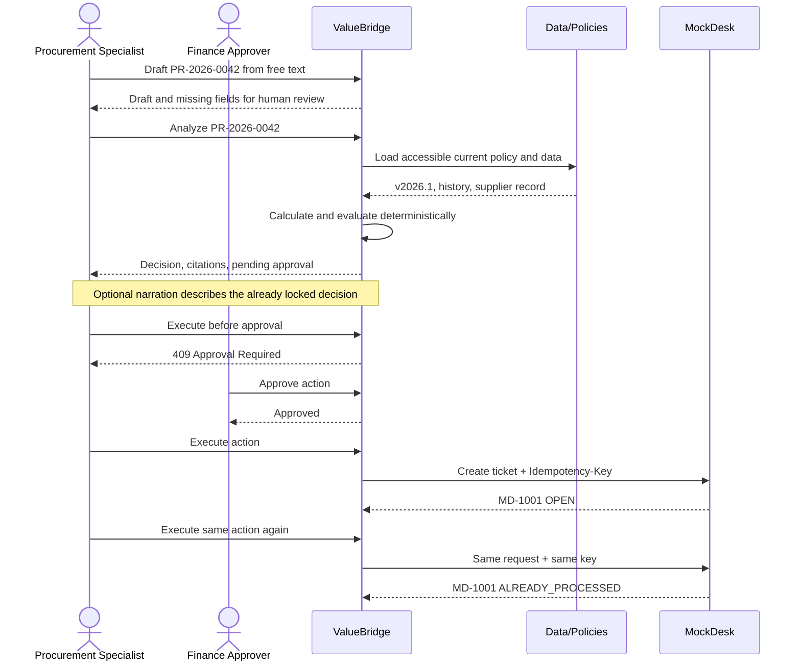

<div align="center">

# ValueBridge

**Süreç keşfinden ölçülebilir, insan onaylı bir kurumsal iş akışına.**

Yapay zekâ destekli satın alma istisna iş akışı — sınırları belirli, üretim disiplinli bir portföy PoC'si.

[](https://github.com/MertArtun/valuebridge-procurement-poc/actions/workflows/ci.yml)
[](https://www.python.org/)
[](https://fastapi.tiangolo.com/)
[](LICENSE)
[](https://valuebridge.62-238-40-66.sslip.io)

[English](README.md) | **Türkçe**

</div>


ValueBridge, bir Solution Engineer'ın belirsiz bir operasyonel süreci nasıl açıklanabilir, kontrollü ve test edilebilir bir yapay zekâ destekli iş akışına dönüştürebileceğini gösterir. Her karar deterministiktir ve insan yönetimindedir; model katmanı isteğe bağlıdır ve yalnızca anlatır, taslak yazar veya atıf verir.

## Canlı demo — 60 saniyelik tur

**https://valuebridge.62-238-40-66.sslip.io**

Ortam hız sınırlıdır ve veritabanı her gece 03:00'te (İstanbul saati) sıfırlanır; orada yaptığınız hiçbir şey kalıcı olmaz. Aşağıdaki numaralı adımları izlerseniz bu sayfanın geri kalanını okumadan sistemin tamamını görmüş olursunuz. [Hızlı başlangıç](#hızlı-başlangıç) aynı sistemi yerelde ayağa kaldırır.

1. **Serbest metinle başlayın ve kontrolün kimde olduğuna dikkat edin.** Talep kutusunda *Hazır örnekler* altındaki **Tek teklifli acil alım** çipine tıklayın — hero senaryosunu forma doldurur. **Taslak Çıkar** düğmesine basın. Model forma bir *taslak* yazar ve eksik alanları listeler. Hiçbir şeyi analiz etmez, karara bağlamaz, göndermez. Akış ancak siz formu gözden geçirip **Talebi Analiz Et** dediğinizde ilerler.

2. **Hero senaryosunu analiz edin.** Atlas Endüstri, 220.000 TL, 1 teklif, 20 gün tedarik süresi. Sonuç `CONDITIONAL_REVIEW`; bölüm düzeyinde politika atıflarına dayanır ve finans onaycısı için tam olarak tek bir onay açar.

3. **Onaylayın, çalıştırın — sonra bir kez daha çalıştırın.** Finans rolüyle onaylayın, ardından aksiyonu çalıştırın; MockDesk yeni bir ticket döner. Şimdi aynı onaylı aksiyonu **ikinci** kez çalıştırın: cevap `ALREADY_PROCESSED` olur ve mükerrer kayıt yerine aynı ticket geri gelir. İzlemeye değer adım budur — idempotency, kullanıcının çift tıklamayacağını ummakla değil, entegrasyon sınırında zorunlu kılınarak sağlanır.

4. **Override'ı olmayan bir kural bulun.** Tedarikçi alanındaki listeyi açın ve askıya alınmış tedarikçi olarak görünen **Vega Hidrolik**'i seçin. Karar `REJECTED` olur, hiç onay açılmaz ve arayüzün hiçbir yerinde "yine de onayla" yolu belirmez.

5. **Eşikleri yoklayın.** Karşılaştırmalar kesin "büyüktür" karşılaştırmalarıdır: **200.000 TL** finans onayı gerekmeden geçer, **200.001 TL** onay gerektirir. **100.000 TL** üzerinde ikinci teklif zorunlu hale gelir — hero senaryosunun tek teklifle temiz geçememesinin sebebi de budur.

6. **Asistanı ele geçirmeyi deneyin.** **Gömülü talimat denemesi** çipi, talep kutusunu modele yönelik gömülü bir talimat içeren metinle doldurur. Taslağı çıkarın: gömülü talimat uygulan*maz*. Veri olarak işlenir, `injection_rule_id` ile işaretlenir ve audit trail'e kaydedilir.

7. **Politika korpusuna iki soru sorun.** **Finans eşiği** çipi, PROC-POL-2026 §4.2'ye atıflı bir cevabı `hybrid` retrieval modunda döner. **Korpus dışı soru** çipi korpusun kapsamadığı bir şeyi sorar ve sistem bunu açıkça söyler — akıcı bir uydurma yerine cevap vermekten kaçınır.

8. **Kayıtlara bakın.** Metrik ve audit panelleri ayrı birer sayaç değildir; her sayı audit trail'den türetilir, dolayısıyla az önce yaptığınız her şey oradan yeniden kurulabilir.

## Hero sonucu

| Sinyal | Deterministik sonuç |
|---|---:|
| Talep tutarı | 220.000 TL |
| Geçmiş medyan | 184.500 TL |
| Sapma | %19,2 |
| Gerekli teklif | 2 |
| Alınan teklif | 1 |
| ISO 9001 bitiş | 2026-06-30 |
| Talep tarihi | 2026-08-18 |
| Karar | `CONDITIONAL_REVIEW` |
| Politika atıfları | PROC-POL-2026 §4.2, §4.3; SUP-COMP-2026 §3.1 |
| Açılan onay | Bir adet, `finance_approver` için |
| Modelin yukarıdakilere etkisi | Yok |

Uyumluluk durumu aktif olmayan bir tedarikçiden gelen talep diğer çıkışa gider: karar `REJECTED`, atıf `SUP-COMP-2026 §2.1` olur ve hiç onay açılmaz — kuralın etrafından dolaşan "yine de onayla" yolu yoktur.

## Bu proje neden var

Hedeflenen rol bir chatbot geliştirmekten ibaret değil. Süreç keşfi, gereksinim analizi, PoC teslimi, kurumsal entegrasyonlar, kurulum sorunlarının çözümü, onboarding ve ölçülebilir sonuçlar gerektiriyor. ValueBridge bu yetkinlikleri tek bir dar iş akışında incelenebilir hale getirir:

```text
Process Discovery
→ Free-Text Intake (optional, human-reviewed)
→ Effective Policy Retrieval
→ Deterministic Analysis
→ Evidence-Backed Decision
→ Action Preview
→ Human Approval
→ Idempotent Enterprise Action
→ Audit and Metrics
```

## Sistem bağlamı



## Hero akışı



`.mmd` kaynakları [`docs/diagrams/`](docs/diagrams) klasöründedir.

## Doğrulanmış sistem davranışı

211 test, 9 proje invariant'ı (`scripts/verify.py`) ve 15 donmuş değerlendirme senaryosu (`scripts/run_evals.py`) şunları kapsar:

**Karar çekirdeği**

- Yürürlükteki politikanın seçilmesi ve yürürlük penceresi dışında kalan talep tarihlerinin açıkça reddedilmesi
- Bölüm düzeyinde atıflar ve politika ile çalışma zamanı eşiklerinin birbirini tutması
- Yalnızca önceki satın almaları kullanan, Decimal tabanlı medyan ve sapma hesapları
- Tedarikçi sertifikası, teklif sayısı ve finans eşiği kuralları
- Aktif olmayan bir tedarikçinin `REJECTED` ile sonuçlanması ve hiçbir onay kaydı oluşmaması

**Yetkilendirme ve kurumsal aksiyon**

- Ret ve süre dolumunu içeren açık onay durum makinesi
- Aynı içerikli yeniden analizde onayın yeniden kullanılması, düzeltilmiş bir analizden sonra ise geçersiz kılınması
- Eşzamanlılık altında atomik onay/ret geçişleri
- Eşzamanlılık altında atomik ve payload-aware idempotent ticket oluşturma
- Sınırlı retry/backoff ve güvenli `Retry-After` işleme
- Reddedilen ve engellenen onay ile çalıştırma denemelerinin izlenebilir audit olayları olarak kaydedilmesi

**Model sınırı**

- Model katmanı açıkken ve kapalıyken karar alanlarının bayt bayt aynı kalması
- Anlatımın onay fingerprint'ine dahil edilmemesi; sağlayıcı hatasında `llm_narrative` alanının null kalması ve `NARRATION_SKIPPED` audit olayının yazılması
- Anahtar yokken intake'in `503 LLM_DISABLED` dönmesi ve taslağı çıkarılmış bir talebin kendiliğinden analiz başlatmaması
- Tedarikçi eklerindeki ve talep metnindeki injection örüntülerinin veri olarak işaretlenip karantinaya alınması, asla çalıştırılmaması
- Sağlayıcı hatalarının durum kodu veya exception sınıfı olarak yüzeye çıkması, hiçbir zaman sağlayıcı yanıt gövdesiyle değil
- Kabukta hazır bulunan sağlayıcı kimlik bilgilerinin her testte temizlenmesi; böylece CI anahtarsız yolu kanıtlar

**Yönetişimli retrieval**

- Yürürlük tarihi, rol ve güven filtrelerinin, ortada herhangi bir ilgililik skoru oluşmadan önce uygulanması
- Yürürlükten kalkmış 2025 politikasının ve güvenilmeyen tedarikçi ekinin aday havuzuna hiç girmemesi (`RAG-001`, `RAG-002`)
- Embedding indeksi veya sağlayıcı yokken hybrid retrieval'ın lexical moda düzgün biçimde gerilemesi
- Türkçe noktalı büyük `İ` harfinin tokenizasyondan önce küçültülmesi; böylece kelimenin birleşen işaretten bölünmemesi

**Ölçüm ve arayüz**

- Pilot metriklerinin ayrı bir sayaçtan değil, audit trail'den türetilmesi
- Onay ve ret kontrollerinin, aksiyon önizlemesi yüklenene kadar devre dışı kalması
- API kontrolündeki `innerHTML` kullanılmadan güvenli DOM render'ı
- Tarayıcı güvenlik header'ları ve Docker build context dışlamaları

Bu kontroller sistem davranışını doğrular; müşteri getirisini veya üretim etkisini değil.

## Mimari

```text
Browser / API client
  → FastAPI ValueBridge
      → Intake drafting                     [model, display-only, optional]
      → Effective policy repository
      → Purchase-history analysis
      → Deterministic policy engine
      → Decision narration                  [model, display-only, optional]
      → Approval state store
      → Governed policy retrieval           [BM25 always; embeddings optional]
      → Audit store
          → Pilot metrics
      → MockDesk HTTP API
          → Atomic idempotency store
```

Kritik kararlar hiçbir koşulda model çıktısına bağlı değildir. Model, kilitlenmiş bir kararı anlatır, insanın onaylaması gereken bir talep taslağı yazar ve yalnızca retrieval'ın yönetişimini zaten yaptığı bölümlerden cevap verir — kural sonuçlarını, yetkilendirmeyi, onay durumunu, araç parametrelerini veya hangi belgelerin getirilebileceğini değiştiremez.

### Talep alımı: serbest metin girer, gözden geçirilebilir taslak çıkar


`POST /api/v1/requests/intake`, bir cümleyi eksikleri açıkça listeleyen (`missing_fields`) bir `PurchaseRequestDraft` nesnesine çevirir. Taslak forma düşer; herhangi bir analiz yapılmadan önce bir insan onaylar. Metin bir injection denemesi içeriyorsa hem yanıtta hem audit trail'de `injection_rule_id` set edilir — veri olarak işaretlenir, fazlası değil.

### Politika soru-cevap: yönetişim, skorlamadan önce çalışır


`POST /api/v1/policies/ask` aday kümesini; soruyu soranın okumaya yetkili olduğu, durumu `CURRENT` olan ve yürürlük penceresi sorulan tarihi kapsayan belgelerden kurar. Yürürlükten kalkmış politika ve güvenilmeyen tedarikçi ekleri, herhangi bir skor hesaplanmadan önce elenir; böylece hiçbir benzerlik sinyali onları geri getiremez. BM25 her zaman çalışır; embedding katmanı isteğe bağlıdır ve indeks ya da sağlayıcı yoksa `lexical` moda geriler. Cevap yalnızca dönen bölümlere atıf verir.

### Ölçüm: metrikler doğrudan audit trail'den


`GET /api/v1/metrics/summary`, kayıtlı audit olaylarını karar dağılımına, onay sonuçlarına, açılan ticket sayısına, engellenen mükerrer kayıtlara, karantinalara, reddedilen veya engellenen aksiyonlara ve medyan çevrim süresine dönüştürür. Audit trail'in yeniden kuramayacağı hiçbir şey sayılmaz. Bkz. [`docs/10_PILOT_METRICS.md`](docs/10_PILOT_METRICS.md).

## Hızlı başlangıç

```bash
python -m venv .venv
source .venv/bin/activate
pip install -e '.[dev]'
ruff check .
node --check app/static/app.js
pytest -q
python scripts/verify.py
python scripts/run_evals.py
```

MockDesk'i çalıştırın:

```bash
uvicorn mockdesk.main:app --port 8001
```

Başka bir terminalde ValueBridge'i çalıştırın:

```bash
MOCKDESK_URL=http://127.0.0.1:8001 uvicorn app.main:app --reload --port 8000
```

`http://127.0.0.1:8000` adresini açın.

Docker alternatifi:

```bash
docker compose up --build
```

İki servis de ayaktayken assertion tabanlı uçtan uca demoyu çalıştırın:

```bash
bash scripts/demo.sh
```

### İsteğe bağlı: model katmanını açmak

Yukarıdakilerin tamamı hiçbir kimlik bilgisi olmadan çalışır ve test paketinin tamamı anahtarsız koşar. Talep alım asistanını, karar anlatımını ve üretilen politika cevaplarını açmak için [`.env.example`](.env.example) dosyasını kopyalayın ve şunları tanımlayın:

| Değişken | Amacı |
|---|---|
| `VALUEBRIDGE_LLM_API_KEY` | Sağlayıcı anahtarı. Tanımlı değilse katman kapalı kalır. |
| `VALUEBRIDGE_LLM_MODEL` | Model kimliği, örneğin `google/gemini-2.5-flash-lite`. |
| `VALUEBRIDGE_LLM_BASE_URL` | OpenAI uyumlu herhangi bir base URL; varsayılanı OpenRouter. |
| `VALUEBRIDGE_EMBEDDINGS_MODEL` | Hybrid retrieval için embedding modeli. |

Modeli değiştirmek tek satırlık bir konfigürasyon işidir; tam olarak hiçbir modelin bir karara sahip olmaması sayesinde.

Hybrid retrieval ayrıca kayıtlı bir indeks ister. Anahtar tanımlıyken:

```bash
python scripts/embed_policy_sections.py
```

Bu komut `data/policy_embeddings.json` dosyasını yazar; sonrasında `/api/v1/policies/ask` `retrieval_mode: "hybrid"` bildirir. Dosya yoksa retrieval `lexical` kalır ve yönetişim filtreleri değişmez. `scripts/record_llm_fixtures.py`, testlerin kullandığı kayıtlı sağlayıcı yanıtlarını tazeler; CI hiçbir zaman bir sağlayıcıya çıkmaz.

## Doküman rehberi

`docs/` klasörü, vaka çalışmasının müşteriye dönük yazılı izidir. En iyi giriş noktaları:

| Doküman | Ne anlatır |
|---|---|
| [01 — Yönetici özeti](docs/01_EXECUTIVE_BRIEF.md) | Problemin ve çözümün tek sayfalık iş özeti |
| [02 — PRD](docs/02_PRD.md) | Problem tanımı, personalar, fonksiyonel gereksinimler, hedef dışı maddeler ve yayın kapıları |
| [03 — FDE vaka çalışması](docs/03_FDE_CASE_STUDY.md) | Süreç keşfi: paydaşlar, mevcut/hedef akışlar, keşif soruları, pilot ve devir planı |
| [05 — Mimari](docs/05_ARCHITECTURE.md) | Bileşenler, sınırlar ve [docs/adrs](docs/adrs) altındaki karar kayıtları |
| [07 — Güvenlik tehdit modeli](docs/07_SECURITY_THREAT_MODEL.md) | Güven sınırları, güvenilmeyen girdiler ve injection'ın etkisiz kılınması |
| [08 — Değerlendirme planı](docs/08_EVALUATION_PLAN.md) | Donmuş değerlendirme aileleri, LLM kalite benchmark'ı ve tarihli referans koşusu |
| [09 — SkyStudio iş akışı taslağı](docs/09_SKYSTUDIO_WORKFLOW_BLUEPRINT.md) | Belgelenmiş SkyStudio yapılarına adım adım eşleme — doğrulanmamış durumu açıkça belirtilmiş |
| [10 — Pilot metrikleri](docs/10_PILOT_METRICS.md) | Audit trail'in bugün ölçtükleri ve gerçek bir pilotta baseline alınacaklar |
| [11 — Demo scripti](docs/11_DEMO_SCRIPT.md) | 90 saniyelik yönetici demosu ve teknik anlatım |
| [13 — Varsayımlar ve sınırlar](docs/13_ASSUMPTIONS_LIMITATIONS.md) | Neyin sentetik olduğu, neyin kapsam dışı olduğu ve nedenleri |

## Depo haritası

```text
app/          ValueBridge API, domain logic, model clients, UI and persistence
app/prompts/  Intake, narrator and policy-answer system prompts
mockdesk/     Independent mock enterprise ticketing service
data/         Synthetic policies, suppliers and purchase history (the embedding index is generated, not committed)
tests/        Behavioral, security, concurrency and model-boundary tests
docs/         PRD, architecture, FDE case, security, evaluation and delivery plan
evals/        Frozen evaluation cases and independent policy oracle
scripts/      Verification, evaluation, provider maintenance and demo helpers
```

## Güvenlik ve güvenilirlik sınırları

- Tarayıcı girdisi, tedarikçi ekleri, talep metni ve model çıktısı güvenilmez kabul edilir.
- API değerleri HTML enjeksiyonuyla değil, DOM `textContent` üzerinden render edilir.
- Retrieval; içeriği döndürmeden ve skorlamadan önce güven, rol, tür ve yürürlük tarihine göre filtreler.
- Model sınırı hiçbir zaman hesaplamalara, politika kurallarına, onaya, retrieval kapsamına veya idempotency'ye sahip olmaz.
- Sağlayıcı anahtarı yalnızca ortam değişkenlerinden okunur; sağlayıcı hataları durum kodu veya exception sınıfıyla bildirilir, yanıt gövdesi hiçbir zaman geri yansıtılmaz.
- Bütün yazma aksiyonları onaylanmış bir kayıt gerektirir.
- Idempotency anahtarı onaylanmış aksiyon örneğine bağlıdır; böylece düzeltilmiş bir yeniden analiz kalıcı bir çakışma yerine yeni bir anahtar alır.
- Idempotency anahtarı kanonik bir payload hash'ine bağlanır.
- Aynı anahtar ve aynı payload orijinal ticket'ı döner.
- Aynı anahtar ve farklı payload `IDEMPOTENCY_CONFLICT` döner.
- Yeniden deneme girişimleri aynı idempotency anahtarını kullanır ve sayıca sınırlıdır.

Bkz. [`docs/07_SECURITY_THREAT_MODEL.md`](docs/07_SECURITY_THREAT_MODEL.md) ve [`docs/05_ARCHITECTURE.md`](docs/05_ARCHITECTURE.md).

## SkyStudio durumu

İş akışı taslağı, herkese açık SkyStudio ürün ve API dokümantasyonuna dayanır. Yetkili bir SkyStudio çalışma alanında doğrulanmamıştır ve tamamlanmış bir entegrasyon olarak sunulmamaktadır. Her adımı somut bir SkyStudio yapısına ve ValueBridge endpoint'ine eşler; bir SkyStudio asistanının konuşmayı yürüttüğü ve `/requests/intake` ile `/requests/analyze` uçlarını araç olarak çağırdığı hedef kurgu da buna dahildir. Bkz. [`docs/09_SKYSTUDIO_WORKFLOW_BLUEPRINT.md`](docs/09_SKYSTUDIO_WORKFLOW_BLUEPRINT.md).

## Bilinen sınırlar

- Sentetik saha keşfi ve operasyon verisi
- Üretim kimlik doğrulaması/SSO yerine demo header'ları
- Yönetişimli kurumsal bilgi altyapısı yerine dosya tabanlı politika deposu
- Yönetilen PostgreSQL yerine SQLite
- Tam bir içerik güvenliği sistemi yerine örüntü tabanlı injection tespiti
- Model katmanı isteğe bağlı ve yalnızca gösterim amaçlıdır; anahtarsız bir kurulumda taslak çıkarma, karar anlatımı ve üretilmiş politika cevabı görünmez
- Embedding indeksi, yönetişimli bir vektör deposu değil, BM25'in yanında duran bir JSON dosyasıdır
- Model çıktıları otomatik olarak puanlanmaz; donmuş değerlendirmeler cevabın ifadesini değil, yönetişimi ve kararları doğrular
- Değişmez kurumsal audit altyapısı yerine yerel ve değiştirilebilir audit deposu
- Canlı SkyStudio, Jira veya ERP çalışma alanı yok
- Ölçülmüş benimsenme, getiri veya çevrim süresi sonucu yok

## Bağımsız çalışma notu

Bu depo resmî bir SKYMOD ürünü değildir ve SKYMOD tarafından desteklenmemektedir. SKYMOD ve SkyStudio markaları sahiplerine aittir. EgeMekanik A.Ş., Atlas Endüstri ve tüm operasyonel veriler sentetiktir.
